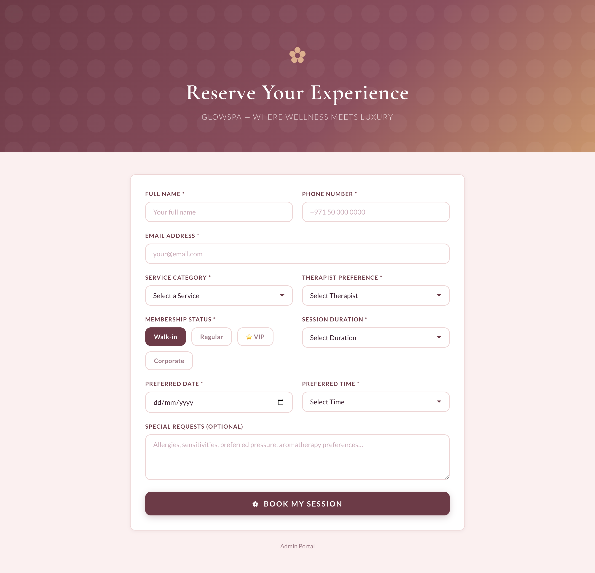
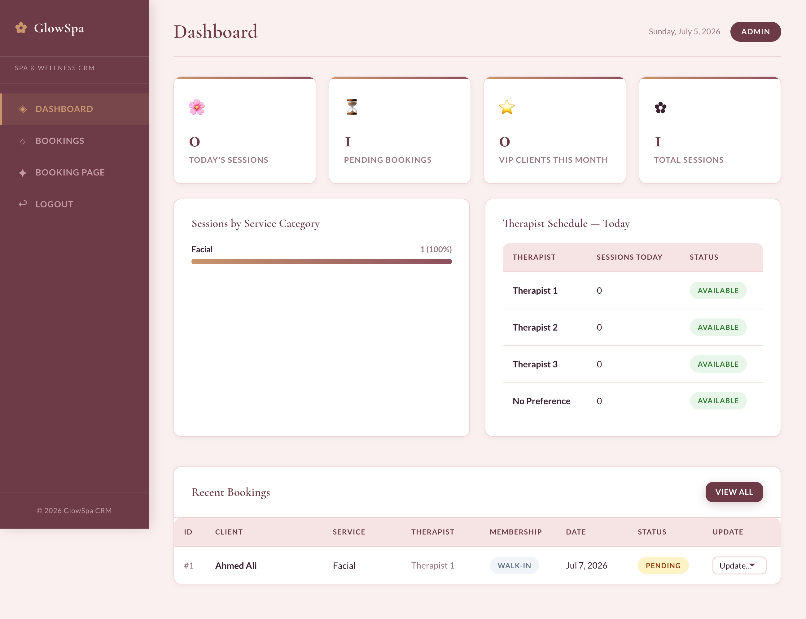
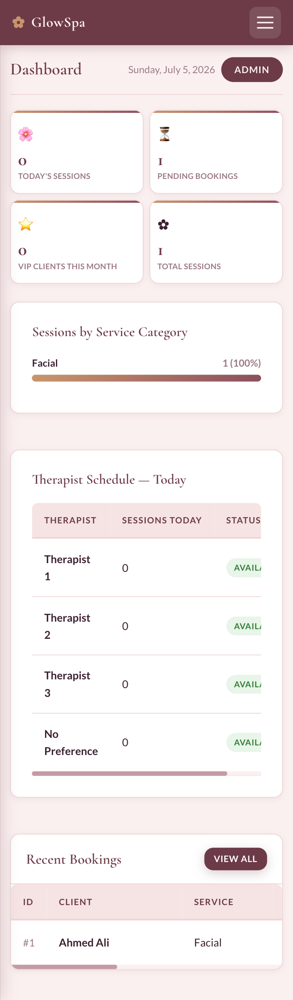
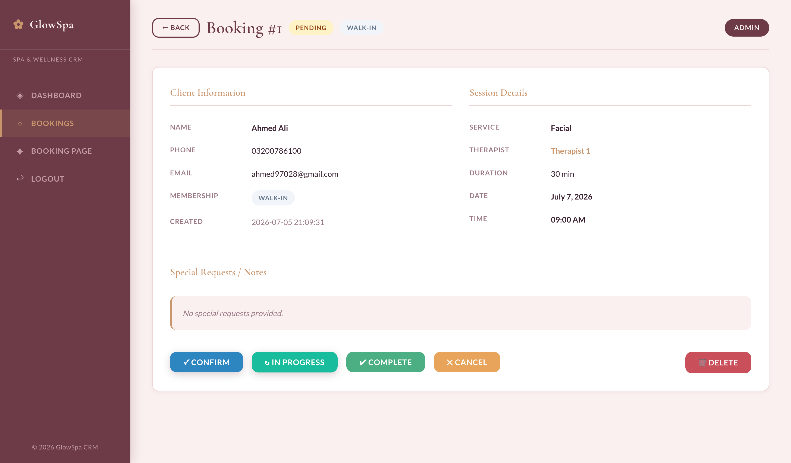
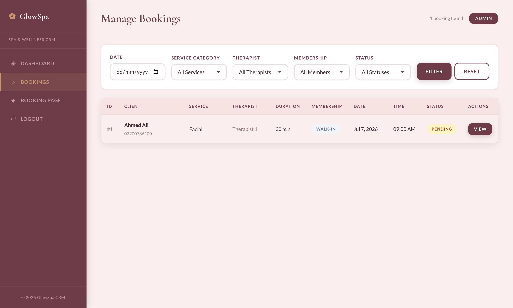
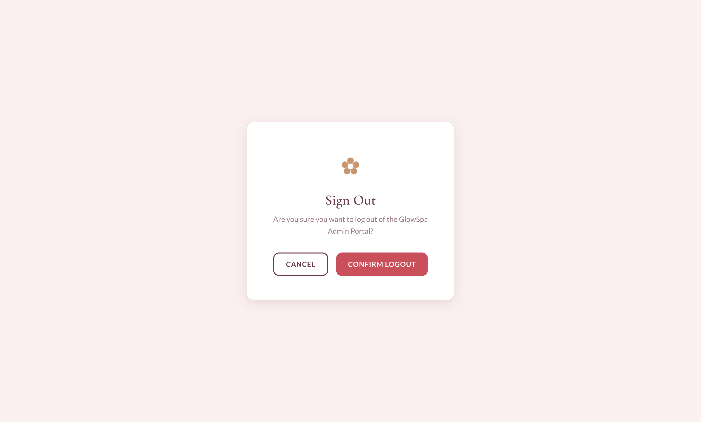

# GlowSpa CRM

> **GlowSpa CRM** is a lightweight, flat-file PHP CRM built for **Spas, Beauty Salons & Wellness Centers**. No database, no dependencies — just drop it on any PHP server and go.

---

## ✿ Features

- **Public Booking Page** — clients self-book sessions in seconds
- **Admin Dashboard** — stat cards, service category chart, therapist schedule
- **Booking Management** — filters by service, therapist, membership, date, status
- **VIP & Membership Badges** — Walk-in / Regular / VIP / Corporate
- **Flat-file JSON Storage** — zero database setup required
- **Session-based Auth** — bcrypt password verification
- **Responsive Design** — works on mobile, tablet, and desktop

---

## 📸 Screenshots

| Public Booking Page | Admin Dashboard (Desktop) | Admin Dashboard (Mobile) |
|:---:|:---:|:---:|
|  |  |  |

| Appointments List | Appointment Detail | Logout |
|:---:|:---:|:---:|
|  |  |  |

---

## 🌸 Design System

| Token | Value |
|---|---|
| Rose Gold | `#C9956C` |
| Blush Pink | `#FAF0F0` |
| Deep Mauve | `#6D3B47` |
| Heading Font | Cormorant Garamond |
| Body Font | Lato |
| Border Radius | 12px |

---

## 📁 File Structure

```
glowspa-crm/
├── index.php               ← Public booking page
├── book.php                ← Booking form processor
├── assets/
│   └── style.css           ← Full design system
├── includes/
│   ├── auth.php            ← Session-based auth guard
│   ├── config.php          ← Admin credentials & settings
│   └── storage.php         ← Flat-file JSON CRUD
├── admin/
│   ├── index.php           ← Redirect to login
│   ├── login.php           ← Admin login
│   ├── dashboard.php       ← Stats + charts
│   ├── appointments.php    ← Booking list + detail view
│   └── logout.php          ← Session destroy
└── data/                   ← Auto-created on first run
    ├── .htaccess           ← Deny from all (auto-generated)
    ├── appointments.json   ← All booking records
    └── meta.json           ← Auto-increment ID counter
```

---

## 🚀 Quick Start

1. Copy the `glowspa-crm/` folder to your PHP server's web root (or any subdirectory).
2. **Security Setup:** Copy `includes/config.example.php` to `includes/config.php`.
3. Point your browser to `http://yourserver.com/glowspa-crm/`
4. The `data/` directory and JSON files are created automatically on first visit.
5. Go to `/admin/login.php` to access the admin portal.

**Default credentials (must be configured in `includes/config.php`):**
| Field | Value |
|---|---|
| Username | `admin` |
| Password | *(Set your own hash)* |

### 🔐 How to Set Your Password

For security, the CRM stores your password as a bcrypt hash in `includes/config.php`. Never store passwords in plain text!

1. Open your terminal or command prompt.
2. Run the following PHP command to generate a secure hash (replace `YourSecretPassword`):
   ```bash
   php -r "echo password_hash('YourSecretPassword', PASSWORD_BCRYPT);"
   ```
3. It will output a long string starting with `$2y$`. Copy that string.
4. Open `includes/config.php` and update the `ADMIN_PASSWORD_HASH` definition with the new hash:
   `define('ADMIN_PASSWORD_HASH', 'YOUR_COPIED_HASH_HERE');`

---

## 🛁 Booking Fields

| Field | Type |
|---|---|
| Full Name | Text |
| Phone | Text |
| Email | Email |
| Service Category | Select (Facial, Massage, Nail Care, Waxing, Body Wrap, Hair Treatment, Couple Spa, Other) |
| Therapist Preference | Select (Therapist 1–3, No Preference) |
| Membership Status | Radio (Walk-in, Regular, VIP, Corporate) |
| Session Duration | Select (30 / 60 / 90 / 120 min) |
| Preferred Date | Date |
| Preferred Time | Select (30-min slots, 9 AM–9 PM) |
| Special Requests | Textarea (allergies, preferences) |

---

## 🔒 Security

- `.htaccess` auto-generated in `data/` to block direct web access
- Passwords verified with PHP `password_verify()` (bcrypt)
- All user inputs sanitized with `htmlspecialchars()`
- Session-based authentication with `session_destroy()` on logout

---

## 📋 Requirements

- PHP 7.4+
- Write permissions on the project folder (for `data/` creation)
- Apache or Nginx with `.htaccess` support

---

*Built with ✿ for the wellness industry.*
